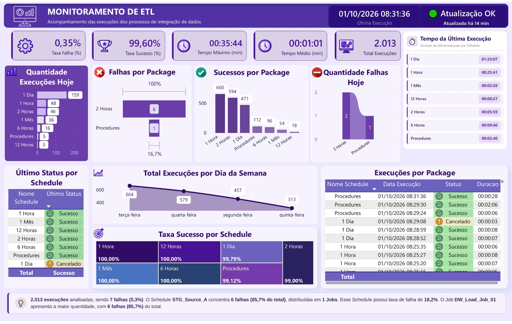

   ETL Monitoring Dashboard

A Power BI dashboard designed to monitor the health and performance of scheduled ETL processes.

The solution centralizes execution history, failures, execution times, schedule status, and data freshness into a single monitoring interface.

Instead of manually reviewing SQL Server Agent job history to identify failures or performance issues, the dashboard provides a consolidated view of what ran, what failed, how long each execution took, and the current status of each schedule.

## What does the dashboard answer?

- Are the schedules currently running successfully?
- Did any schedule fail during its latest execution?
- How many executions occurred today?
- How many executions failed?
- What are the overall success and failure rates?
- Which schedules have the highest number of failures?
- What is the average execution time?
- What was the longest execution?
- How recently was the data updated?
- What is the latest status of each schedule?

## Solution Overview

```text
SQL Server Agent (msdb)
        │
        ▼
   T-SQL Query
        │
        ▼
   Power BI Model
        │
        ▼
     Dashboard
        │
        ├── KPIs
        ├── Status Monitoring
        ├── Failure Detection
        ├── Execution Performance
        └── Schedule Analysis
```

### Data Flow

1. **Source**  
   SQL Server Agent execution history is stored in the `msdb` system database.

2. **SQL Layer**  
   A T-SQL query consolidates job and step execution history into a structured dataset containing schedule, step, status, execution timestamp, and duration information.

3. **Power BI Model**  
   The resulting dataset is loaded into Power BI and organized into the `Execucoes` and `Atualização` tables.

4. **DAX Layer**  
   DAX measures calculate operational KPIs, execution rates, durations, latest schedule status, failure detection, and data freshness.

5. **Dashboard**  
   The indicators are presented through a centralized monitoring dashboard for faster operational analysis.

## Key Indicators

| Indicator | Description |
|---|---|
| **Success / Failure Rate (%)** | Proportion of successful and failed executions |
| **Total Executions** | Total number of executions analyzed |
| **Average / Maximum Execution Time** | Average execution duration and longest execution |
| **Today's Executions / Failures** | Number of executions and failures for the current day |
| **Latest Status by Schedule** | Most recent execution status for each schedule |
| **Overall Status** | Consolidated status indicating whether a recent schedule failure was detected |
| **Data Freshness** | Time elapsed since the last data refresh |
| **Success Rate by Schedule** | Comparison of execution reliability across schedules |

## Technologies

- **Power BI**
- **DAX**
- **T-SQL**
- **SQL Server**
- **SQL Server Agent**
- **Power Query**
- **Data Visualization**

## Repository Structure

```text
etl-monitoring-dashboard/
│
├── README.md
│
├── sql/
│   └── query_schedule.sql
│
├── dax/
│   └── indicadores.dax
│
└── images/
    └── dashboard.png
```

### SQL

The `sql` folder contains the T-SQL query responsible for extracting and transforming SQL Server Agent execution history into a dataset suitable for Power BI.

### DAX

The `dax` folder contains the Power BI measures used to calculate KPIs, execution rates, durations, schedule status, alerts, and data freshness.

### Images

The `images` folder contains screenshots of the dashboard and its visual components.

## Dashboard Preview



## Public Portfolio Version

This repository is intended for portfolio and demonstration purposes.

The public version uses a sanitized and generic project structure and does not expose proprietary business data, credentials, servers, or confidential organizational information.

The objective is to demonstrate the technical approach, data modeling, SQL transformations, DAX calculations, and Power BI visualization used to build an ETL monitoring solution.

  Author

Denise Jesus Teixeira

[LinkedIn](https://www.linkedin.com/in/denise-teixeira-ab1896146)
